<p align="center">
  
</p>

# Trading-Analyse-App

A private, local analysis tool built around one question: **what should I do with my money this
month, and why?**

The core is an **investment adviser** — profile and goals, an equity share derived per goal,
concrete ETFs, a savings plan, a German tax engine, a projection, and one monthly recommendation.
Around it, at unchanged depth: evidence-based trading signals (swing, intraday), market
intelligence, an options module, a stock-ranking prediction engine, a practice simulator and a
learning path. Python + a local Streamlit dashboard. Broker connection (Interactive Brokers) is
optional and disabled by default.

**Not investment advice. Not shared with anyone. Data budget: 0 €.**

---

## Status

**Phase 1 is built and verified.** The specification (phases 0 and 0b) is complete and
independently reviewed; the bitemporal data layer now exists in code.

| Phase | What | State |
|---|---|---|
| 0 | Research, tooling and evidence survey | done |
| 0b | Quality standards, calculation-core spec v1.4, investment spec v1.2, strategy catalogue v1.2, plan v9 | done |
| 1 | Foundation: bitemporal store, `PointInTimeView`, EODHD adapter, leakage tests | **done** — 77 tests, all green |
| 1b | Instrument master data for ETF selection (A5): per-field provenance, hard filters | in progress |
| 2 | Backtest engine: cost model, execution rules, performance statistics, walk-forward | planned |
| 2b | UI concept and mockups | planned |
| 3 | **Core module "Anlegen"** (investment adviser) — first usable version | planned |
| 3b–5b | Simulator, swing module, intraday module | planned |
| 6–8b | Market intelligence, options module, prediction engine | planned |
| 9 | Paper trading, ≥ 3 months, no real money | planned |
| 10 | Execution adapter (optional, off by default) | planned |

Detailed gates per phase: `docs/20260925_trading-app-plan-v9.md` §6.

---

## The investment adviser

This is the part the whole project is now organised around. It is specified in full in
`docs/20260925_anlage-spezifikation.md` (A1–A15, English reading copy alongside it).

### Three competing limits — the lowest wins

The equity share for a goal is not a preference setting. It is the **minimum of three independent
ceilings**, rounded down to 10 percentage points:

- **Horizon** — a glide path from the years remaining until the money is needed.
- **Capacity** — what the plan survives. Volatile income or dependants cap it at 70 %; income
  correlated with the equity market at 80 %.
- **Tolerance** — what the person sits through.

Tolerance is **measured in euros, not as a self-rating**: *how much of 10,000 € could fall before
you would sell?* A self-assessed "risk appetite" predicts nothing useful; a euro figure is
something a person can actually picture. The loss budget is then **capped jointly across all
goals**, because a crash arrives on the total, not per pot.

### Order of finances before any product

No recommendation is produced until the preconditions hold: **expensive debt → emergency fund →
invest**. Debt above ~5 % nominal returns a *certain* yield at that rate, which beats the
*uncertain* equity return on a risk-adjusted basis. The spec refuses to name a fund before that.

### The base portfolio, and what overlays may do

L1 — a market-cap-weighted world portfolio, rebalanced — is **no longer a strategy you pick. It is
the base portfolio.** L2–L4 and S1 became optional overlays, **off by default**, and they may only
ever **reduce** the equity share, never raise it.

Every overlay faces an **after-tax gate**: an overlay that wins before German tax but loses after
it stays off. Switching is only free in a backtest.

### The tax engine

The most demanding module in the project. German capital-gains tax (`ESt = (e − 4q) / (4 + k)`),
the Vorabpauschale, partial exemption under InvStG 2018, Günstigerprüfung, NV-Bescheinigung, loss
pots, § 23 EStG for gold, and a tax-optimised sale ordering. Throughout in **`Decimal`, never
`float`** — bank withholding and assessment differ by a cent, and the spec documents both.

The spec requires **external review by a tax adviser before productive use.**

### Projection: deliberately pessimistic

Block bootstrap over a multi-country history (Jordà-Schularick-Taylor), conservatively centred,
displayed in **today's euros**. No "8 % per year" line.

### ETF selection (A5) and its data

Hard filters first (UCITS, German KID, Xetra-tradeable, fund size ≥ 100 m €, ≥ 3 full calendar
years, equity-fund definition under § 2 (6) InvStG), then a score on **fixed absolute scales** —
not min-max normalisation, so adding one fund does not reshuffle the others. Weights: net cost
(tracking difference, 3-year mean) 40 %, fund size 20 %, liquidity 10 %, structure and
counterparty risk 10 %, TD stability 5 %, history 5 %, KID transaction costs 5 %, user preference
5 %. Comparison groups contain **only funds tracking the same index** — tracking differences
against different indices are not comparable.

Data collection is **rule-bound**: A5.1 forbids automated queries against justETF and Vanguard
(their terms) and undocumented issuer APIs. Permitted is the manual or low-frequency download of
public mandatory documents (PRIIPs KID, factsheet). So the instrument layer has **no scraper** —
it reads a human-maintained source file where every field carries its source URL and as-of date,
and the forbidden domains are blocked in code, with a test proving it.

---

## What else the app does

| Area | Content |
|---|---|
| **Trading** | Swing signals (hourly to daily) and intraday signals (minute bars) for gold and commodities, equities, ETFs/ETCs, futures, CFDs |
| **Prediction engine** | Monthly ranking of large liquid stocks by their calibrated probability of beating the universe median over 1 and 3 months |
| **Market intelligence** | News briefing, insider filings, an expert scorecard that tracks whether loud public forecasts actually came true |
| **Options** | Chain valuation, greeks, fair-value assessment; strategy templates locked until learning stage 6 |
| **Portfolio** | Positions, risk, journal — manual entry, CSV import, or optional IBKR sync |
| **Learning path** | Staged curriculum; several modules stay locked until the matching stage is passed |
| **Simulator** | A live practice account on real (≈ 15 min delayed) prices |

Out of scope: crypto, passing signals to third parties (would make it BaFin-relevant), fully
automatic order execution.

**Guiding principle:** the benchmark for every module is a cheap, broadly diversified ETF.
Anything that does not beat it after costs and risk-adjusted is not shown as a signal.

---

## The rules this project runs on

These are the non-negotiables. They exist because a backtest is trivially easy to fake by
accident.

- **Spec before code.** If code needs a rule the spec does not contain, the spec changes first
  (new version + changelog entry), then the code. Anything marked `UNVERIFIZIERT` is checked
  against its primary source before it is implemented.
- **Point-in-time only.** Strategy and model code reads data exclusively through
  `PointInTimeView(t)` — rows with `available_at <= t`. Storage is bitemporal and append-only.
  Three leakage tests (truncation, future perturbation, delay) run on every build.
- **Execution never at the signal price.** Next bar at the earliest, plus spread, fee and
  slippage (spec C4, E1–E13).
- **No dependency without an audit.** Every package needs an entry in `DEPENDENCIES.md`
  following the audit protocol (standards §1.1) and explicit approval. Lockfile with hashes,
  wheels only (`no-build = true`), `pip-audit` clean.
  Banned: `pandas-ta`, `ibapi`/`ibapi-stable`/`ibapi-latest` from PyPI, `ib_insync`,
  `py_vollib_vectorized`, `mlfinlab`.
- **Green tests are not evidence.** Every module is mutation-tested: deliberate sabotage is
  introduced one at a time and the suite must go red. A test that does not catch its mutant is
  worse than no test.
- **Every calculation module** additionally passes reference-value tests, a second independent
  implementation where the spec demands one, property-based invariants, and a review by an
  agent that did not write the code.
- **Broker safety.** IB Gateway on `127.0.0.1` with Read-Only API while execution is disabled;
  paper account first; secrets in `.env` outside the repo or in the macOS keychain.
- **Honest numbers.** No probability is displayed without passed calibration. "No signal" is a
  normal, calm state — not an error.
- **Tax and money arithmetic in `Decimal`**, rounded exactly as spec A8 prescribes. No floats.

---

## The data layer (phase 1, built)

`src/trading_app/bitemporal.py` — 458 lines. Two rules drive the whole design:

**Append-only.** There is no `update()` and no `delete()`. A corrected price is a *new row* with a
later `available_at`. A value of 100.00 recorded on 5 January and corrected to 101.50 on 9 January
still reads **100.00** when queried as of 6 January — which is exactly what the strategy saw at
the time.

**No way to fetch "all data".** The only path to bars runs through `store.view(as_of)`. Look-ahead
bias is structurally impossible rather than a matter of discipline. Naive timestamps are rejected
outright.

`available_at` is set to **market close + 1 hour**. Too early would be look-ahead; too late only
costs signal quality. When in doubt, too late.

### The free-plan trap, and why it aborts

`src/trading_app/sources/eodhd.py` speaks to EODHD. The free plan silently truncates EOD history
to twelve months and returns a `warning` field instead of an error. The adapter **aborts hard** on
that field rather than logging it. A log warning gets overlooked for half a year; a failed run does
not.

Intraday is prepared, not built: `bar_size` is already in the schema, so minute bars need no schema
change — but they would need their own split-adjustment module, because EODHD does not adjust
intraday bars retrospectively. A July 2020 AAPL minute bar reads ≈ 380 $ where the daily bar reads
≈ 95 $. See `docs/20260925_rueckwirkende-anpassung.md`.

### Verification

77 tests, ~1.8 s. Every one of them was checked by mutation:

| Sabotage | Tests that went red |
|---|---|
| Point-in-time filter removed | 6 |
| As-of comparison made exclusive instead of inclusive | 1 |
| Naive timestamps allowed through | 3 |
| Truncation abort weakened to a log warning | 3 |
| API token included in an error message | 1 |

10 mutants planted, 10 killed. Plus a DuckDB timezone trap found and pinned down by two tests:
DuckDB returns timestamps in local time, so a bar at `14 Aug 22:00 UTC` reads
`15 Aug 00:00+02:00` in Berlin — the same instant, looking like a one-day offset, and tempting
you to "fix" it into a real bug.

---

## Repository layout

```
CLAUDE.md          Operating contract for AI agents working in this repo
docs/              The specification — see docs/README.md for precedence order
src/trading_app/   Application code (bitemporal store, data source adapters)
tests/             Test suite, including the leakage tests
DEPENDENCIES.md    Audit protocol entry for every approved package
.env.example       Shape of the secrets file; the real one lives outside the repo
```

Tickets and the working spec live outside the repository in
`~/claude/.scratch/trading-app/` (`spec.md` and `issues/NN-*.md`), one per phase.

### Storage split

Source and docs live in iCloud. Everything heavy or frequently written lives in
`~/claude-local/trading-app/` and is never synced: the virtualenv, the DuckDB database, recorded
intraday bars, caches, backtest outputs, and the `.env` holding the API token. A database inside
iCloud gets corrupted by sync conflicts. Git history lives outside iCloud too:

```
git init --separate-git-dir=~/claude-local/trading-app/git
```

---

## Tech stack

Installed and audited (phase 1):

| Layer | Choice |
|---|---|
| Language | Python 3.13 (project requires ≥ 3.12, < 3.14) |
| Storage | DuckDB 1.5.5 (bitemporal, append-only) |
| Data | pandas 3.0.6, numpy 2.5.3, pyarrow 25.0.1, pydantic 2.13.5 |
| Calendars | exchange-calendars 4.13.2 |
| Scheduling | APScheduler 3.x (4.x is alpha and blocked) |
| Price fallback | yfinance 1.7.0 (cached fallback only) |
| Tests | pytest 9.1.1, hypothesis 6.168.1 |
| Env | uv, wheels only, lockfile with hashes |

Fixed in plan v9 §5 but **not yet installed** — each passes the audit protocol first: vectorbt / bt
(backtesting), skfolio (portfolio), LightGBM + scikit-learn (ML), Streamlit + Plotly (dashboard,
telemetry off, localhost only), `ib_async` (broker, optional, disabled).

---

## Running it

The virtualenv lives outside the repo, so paths are explicit:

```bash
uv sync                                              # create/refresh the env
$HOME/claude-local/trading-app/.venv/bin/python -m pytest tests/ -q
```

A shell alias or `just` recipes come with ticket 01 (`test`, `lint`, `audit`, `run`).

API access needs `~/claude-local/trading-app/.env` (mode 600, outside git and iCloud); the repo
carries only `.env.example` with an empty field.

---

## Disclaimer

Private project, built for one user. No investment advice, no recommendation to buy or sell any
security. Backtested results are not indicative of future performance. The author is not a
licensed financial adviser and the tool is never distributed.
